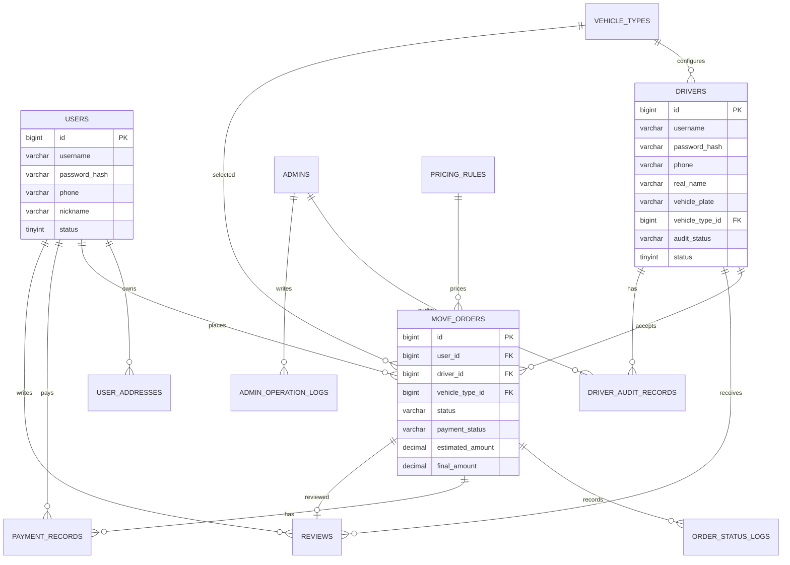

# 搬家预约系统 ER 图

```mermaid
erDiagram
  USERS ||--o{ USER_ADDRESSES : owns
  USERS ||--o{ MOVE_ORDERS : places
  USERS ||--o{ PAYMENT_RECORDS : pays
  USERS ||--o{ REVIEWS : writes
  VEHICLE_TYPES ||--o{ DRIVERS : configures
  VEHICLE_TYPES ||--o{ MOVE_ORDERS : selected
  DRIVERS ||--o{ MOVE_ORDERS : accepts
  DRIVERS ||--o{ REVIEWS : receives
  ADMINS ||--o{ DRIVER_AUDIT_RECORDS : audits
  DRIVERS ||--o{ DRIVER_AUDIT_RECORDS : has
  ADMINS ||--o{ ADMIN_OPERATION_LOGS : writes
  MOVE_ORDERS ||--o{ ORDER_STATUS_LOGS : records
  MOVE_ORDERS ||--o{ PAYMENT_RECORDS : has
  MOVE_ORDERS ||--o| REVIEWS : reviewed
  PRICING_RULES ||--o{ MOVE_ORDERS : prices

  USERS {
    bigint id PK
    varchar username
    varchar password_hash
    varchar phone
    varchar nickname
    tinyint status
  }
  DRIVERS {
    bigint id PK
    varchar username
    varchar password_hash
    varchar phone
    varchar real_name
    varchar vehicle_plate
    bigint vehicle_type_id FK
    varchar audit_status
    tinyint status
  }
  MOVE_ORDERS {
    bigint id PK
    bigint user_id FK
    bigint driver_id FK
    bigint vehicle_type_id FK
    varchar status
    varchar payment_status
    decimal estimated_amount
    decimal final_amount
  }
```

